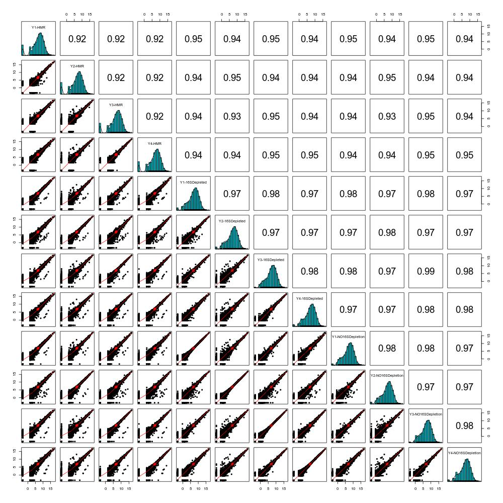

# Testing Custom FLy Oligos For Ribo Depletion

1. Design Oligos: Custom oligos were designed by KAPA so they are compatible with the KAPA ribodepletion kit. We sent them sequences for 28S, 18S, 16S, 5S and 5.8S.

	```
	16S turned out to be AT rich. So we decided to try ribo depletion with and without 16S.
	```
   
2. Library prep: Libraries were prepped using 4 drosophila samples and 3 conditions:

	```

   	Condition #1: Ribodepletion using Human-Mouse-Rat oligos that come with the standard riboerase kit. 
       Sample names - Y1-HMR, Y2-HMR, Y3-HMR, Y4-HMR
       
   	Condition #2: Ribodepletion using custom fly oligos (including 16S). 
       Sample names - Y1-16SDepleted, Y2-16SDepleted, Y3-16SDepleted, Y4-16SDepleted
       
   	Condition #3: Ribodepletion using custom fly oligos (NOT including 16S). 
       Sample names - Y1-NO16SDepletion, Y2-NO16SDepletion, Y3-NO16SDepletion, Y4-NO16SDepletion
       
	```


3. QC: Libraries were QC'ed using BioA and qPCR. HMR kit appeared to be choppy while custom oligo libraries looked good with a bell like distribution of fragments.

4. Sequencing: All libraries were sequenced, in a single lane, on HiSeq 2500 for 50 bases

5. Analysis: 

	1. Amount of duplication (higher mean lower complexity data)
		```
		| Sample Name       | Barcode           | % Dups | % GC |
		|-------------------|-------------------|--------|------|
		| Y1-HMR            | CGGCTATG-TATAGCCT | 72.30% | 42%  |
		| Y2-HMR            | TCCGCGAA-TATAGCCT | 71.20% | 41%  |
		| Y3-HMR            | TCTCGCGC-TATAGCCT | 71.30% | 41%  |
		| Y4-HMR            | AGCGATAG-TATAGCCT | 72.90% | 41%  |
		| Y1-16SDepleted    | ATTCAGAA-CCTATCCT | 47.30% | 48%  |
		| Y2-16SDepleted    | GAATTCGT-CCTATCCT | 49.20% | 48%  |
		| Y3-16SDepleted    | CTGAAGCT-CCTATCCT | 53.80% | 48%  |
		| Y4-16SDepleted    | TAATGCGC-CCTATCCT | 46.40% | 49%  |
		| Y1-NO16SDepletion | ATTCAGAA-GGCTCTGA | 51.70% | 47%  |
		| Y2-NO16SDepletion | GAATTCGT-GGCTCTGA | 50.00% | 48%  |
		| Y3-NO16SDepletion | CTGAAGCT-GGCTCTGA | 51.00% | 47%  |
		| Y4-NO16SDepletion | TAATGCGC-GGCTCTGA | 47.10% | 48%  |
		```
	2. Alignment Rates 
		```
		(Using Bowtie)
		| Sample Name       | Barcode           | Fly Genome Alignment percent    | Fly16S percent**  | All Ribosomal rRNA percent*** |
		|-------------------|-------------------|---------------------------------|-------------------|-------------------------------|
		| Y1-HMR            | CGGCTATG-TATAGCCT | 89.10%                          | 0%                | 63.71%                        |
		| Y2-HMR            | TCCGCGAA-TATAGCCT | 89.38%                          | 0%                | 64.27%                        |
		| Y3-HMR            | TCTCGCGC-TATAGCCT | 89.08%                          | 0%                | 66.73%                        |
		| Y4-HMR            | AGCGATAG-TATAGCCT | 89.76%                          | 0%                | 68.50%                        |
		| Y1-16SDepleted    | ATTCAGAA-CCTATCCT | 84.10%                          | 0%                | 0.52%                         |
		| Y2-16SDepleted    | GAATTCGT-CCTATCCT | 83.99%                          | 0%                | 0.20%                         |
		| Y3-16SDepleted    | CTGAAGCT-CCTATCCT | 84.17%                          | 0%                | 0.16%                         |
		| Y4-16SDepleted    | TAATGCGC-CCTATCCT | 83.95%                          | 0%                | 0.12%                         |
		| Y1-NO16SDepletion | ATTCAGAA-GGCTCTGA | 85.26%                          | 0.73%             | 1.88%                         |
		| Y2-NO16SDepletion | GAATTCGT-GGCTCTGA | 84.91%                          | 0.49%             | 0.65%                         |
		| Y3-NO16SDepletion | CTGAAGCT-GGCTCTGA | 84.79%                          | 0.54%             | 0.63%                         |
		| Y4-NO16SDepletion | TAATGCGC-GGCTCTGA | 85.09%                          | 0.67%             | 0.85%                         |

		(Using sortmerna)
		| Sample Name       | Barcode           | silva-euk-28s-id98.fasta*| silva-euk-18s-id95.fasta*| Fly16S percent**  | All Ribosomal rRNA percent*** |
		|-------------------|-------------------|--------------------------|--------------------------|-------------------|-------------------------------|
		| Y1-HMR            | CGGCTATG-TATAGCCT | 44.18%                   | 23.36%                   | 0.00%             | 68.23%                        |
		| Y2-HMR            | TCCGCGAA-TATAGCCT | 43.03%                   | 24.78%                   | 0.00%             | 68.69%                        |
		| Y3-HMR            | TCTCGCGC-TATAGCCT | 44.63%                   | 25.82%                   | 0.00%             | 71.38%                        |
		| Y4-HMR            | AGCGATAG-TATAGCCT | 48.04%                   | 24.18%                   | 0.00%             | 73.04%                        |
		| Y1-16SDepleted    | ATTCAGAA-CCTATCCT | 0.40%                    | 0.23%                    | 0.00%             | 0.62%                         |
		| Y2-16SDepleted    | GAATTCGT-CCTATCCT | 0.17%                    | 0.09%                    | 0.00%             | 0.26%                         |
		| Y3-16SDepleted    | CTGAAGCT-CCTATCCT | 0.15%                    | 0.08%                    | 0.00%             | 0.21%                         |
		| Y4-16SDepleted    | TAATGCGC-CCTATCCT | 0.14%                    | 0.08%                    | 0.00%             | 0.18%                         |
		| Y1-NO16SDepletion | ATTCAGAA-GGCTCTGA | 0.79%                    | 0.47%                    | 0.76%             | 2.04%                         |
		| Y2-NO16SDepletion | GAATTCGT-GGCTCTGA | 0.13%                    | 0.06%                    | 0.51%             | 0.73%                         |
		| Y3-NO16SDepletion | CTGAAGCT-GGCTCTGA | 0.10%                    | 0.03%                    | 0.56%             | 0.69%                         |
		| Y4-NO16SDepletion | TAATGCGC-GGCTCTGA | 0.16%                    | 0.07%                    | 0.71%             | 0.95%                         |

		* Ribsomal sequences that come as default genomes with sortmerna
		** Only 16S sequence was used for alignment
		*** Only ribosomal sequences from flybase were used
		```
		
	3. Scatter Plot and Correlation: Correlation between "16SDepeleted" and "NO16SDepletion" is generally higher than for the same sample (for example Y3-NO16SDepletion has a higher correlation with Y3-16SDepleted vs (Y1-16SDepleted OR Y2-16SDepleted OR Y4-16SDepleted). This is expected since Y# are not technical replicates.
	
		
	
	4. Clustering 
